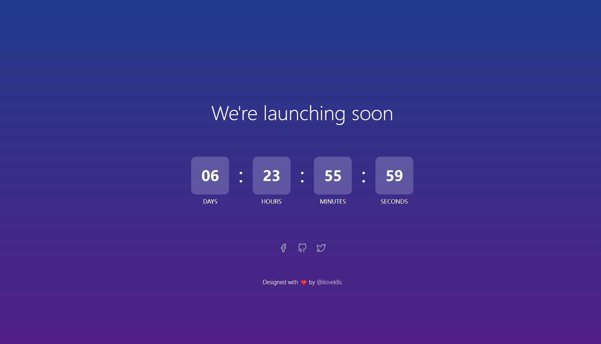

# Countdown Timer

A simple and customizable countdown timer built with Rust and Dioxus.



## Features

- Set custom countdown duration
- Customize countdown message
- Responsive design
- Smooth animations

## Getting Started

These instructions will get you a copy of the project up and running on your local machine for development and testing purposes.

### Prerequisites

- [Rust](https://www.rust-lang.org/tools/install)
- [Dioxus](https://dioxuslabs.com/) 

### Installation

1. Clone the repository:
   ```
   git clone https://github.com/zhuima/countdown-by-rust.git
   cd countdown-by-rust

   ```

2. Build and run the project:
   ```
   make dev
   ```

3. Open your browser and navigate to `http://localhost:8080`

## Usage

1. Click the settings icon to open the settings modal.
2. Enter the number of days for the countdown and a custom message.
3. Click "Save" to update the countdown timer.

## Development

To contribute to this project, please follow these steps:

1. Fork the repository
2. Create a new branch (`git checkout -b feature/AmazingFeature`)
3. Make your changes
4. Commit your changes (`git commit -m 'Add some AmazingFeature'`)
5. Push to the branch (`git push origin feature/AmazingFeature`)
6. Open a Pull Request

## Built With

- [Rust](https://www.rust-lang.org/) - The programming language used
- [Dioxus](https://dioxuslabs.com/) - The web framework used

## License

This project is licensed under the MIT License - see the [LICENSE.md](LICENSE.md) file for details

## Acknowledgments

- Inspired by [Frontend Mentor's Launch Countdown Timer challenge](https://www.frontendmentor.io/challenges/launch-countdown-timer-N0XkGfyz-)
